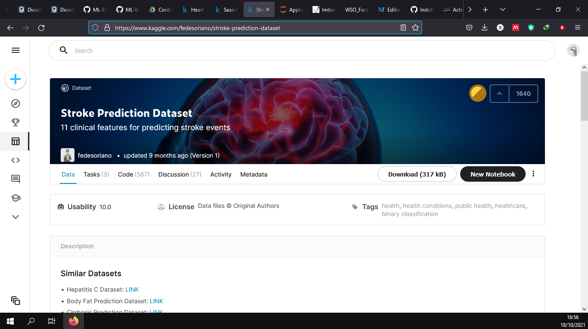

# Laporan Proyek Machine Learning - Ahmad Habib Husaini
### Domain Project
Domain proyek yang dipilih dalam proyek machine learning ini adalah mengenai kesehatan dengan judul proyek **Prediction positive or negative diabetes**".

### Pendahuluan
Kesehatan merupakan salah satu masalah umum yang telah ditetapkan dalam SDG(*Sustainable Development Goals)* oleh PBB. Pada tanggal 29 oktober nanti kita akan memperingati hari hari stroke sedunia. Stroke adalah salah satu penyakit mematikan, berupa gangguan pada fungsional otak akibat dari berbagai faktor salah satunya penyumbatan aliran darah ke otak.[[1]](http://download.garuda.ristekdikti.go.id/article.php?article=1111749&val=10153&title=IDENTIFIKASI%20HIPERTENSI%20DENGAN%20RESIKO%20KEJADIAN%20STROKE). Menurut WSO (*world stroke organization*) pada Global Stroke Fact Sheet 2019 menyatakan setiap tahunnya ada 13 juta kasus baru[[2]](https://www.world-stroke.org/assets/downloads/WSO_Fact-sheet_15.01.2020.pdf). Sudah seharusnya masalah ini tidak hanya berada pada kalangan medis, melainkan segenap rumpun ilmu. Oleh karenanya sebagai sangat membantu jika terdapat sebuat sistem cerdas yang dapat memprediksi seseorang menderita stroke.

# Bussines Understanding
### Problem Statement
- Bagaimana cara membuat model *machine learning* untuk memprediksi seseorang positif stroke atau tidak
- Feature apa saja yang sangat berpengaruh terhadap prediksi seseorang positif stroke atau tidak

### Goals
- Membuat model *machine learning* untuk memprediksi seseorang positif stroke atau tidak
- Mengetahui feature apa saja yang sangat berpengaruh terhadap prediksi seseorang positif stroke atau tidak

### Solution Statements
- #### Metodologi
    Prediksi seseorang positif stroke atau tidak merupakan tujuan dari utama yang ingin diselesaikan, potitif atau tidak (negatif) merupakan variabel diskrit yang berarti pada kasus ini merupakan persoalan klasifikasi. Oleh karena itu, metodologi pada proyek ini adalah: membangun model klasifikasi positif negatif stroke.
- #### Pra-pemrosesan
    - Untuk menjaga agar tidak terjadi data leakage, makan proses train test split dijadikan sebelum proses handling missing values, transformasi dan normalisasi.
    - Menghapus pencilan dengan IQR method
    - Selanjutnya handling missing values, transformasi, normalisasi akan ditangani oleh pipeline dari sklearn.
    - Pada proek kali ini akan dilakukan dua proses training, yang pertama membiarkan data tidak seimbang dan kedua dengan teknik Synthetic Minority Oversampling Technique (SMOTE) dengan algoritma random forest dan Xgboost sebagai algoritma training.

### Data Understanding

informasi data set : 
Attribute  | Keterangan
------------- | -------------
Sumber  | https://www.kaggle.com/fedesoriano/stroke-prediction-dataset
ID | Identitas 
Gender | Jenis kelamin (male, female, other(**dianggap invalid data**))
Hypertension | Nol jika pasien tidak menderita darah tinggi, satu sebaliknya
Heart diseease | Nol jika pasien tidak menderita penyakit jantung, satu sebaliknya
Ever married | Status pernah menikah (Yes or No)
Work type | Jenis pekerjaan terdiri dari anak-anak, Pekerjaan pemerintah, Tidak pernah bekerja, Swasta atau Wiraswasta
Residence type | Tipe tempat tinggal Rural (pedasaan) atau Urban (perkotaan)
Avg glucose type | rata-rata kadar gula dalam darah
BMI | body mass index
Smoking status | formerly smoked (Sebelumnya merokok), never smoked (tidak pernah merokok), smokes (merokok) atau "Unknown" (dianggap invalid data)
Stroke | satu jika pasien positif stroke nol sebaliknya

### Analysis Univariate

### Data Preparation

### Modeling

### Evaluation

### *Referensi*
