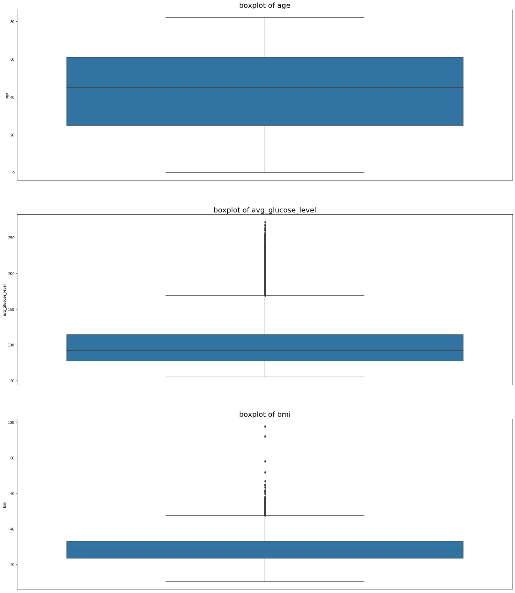
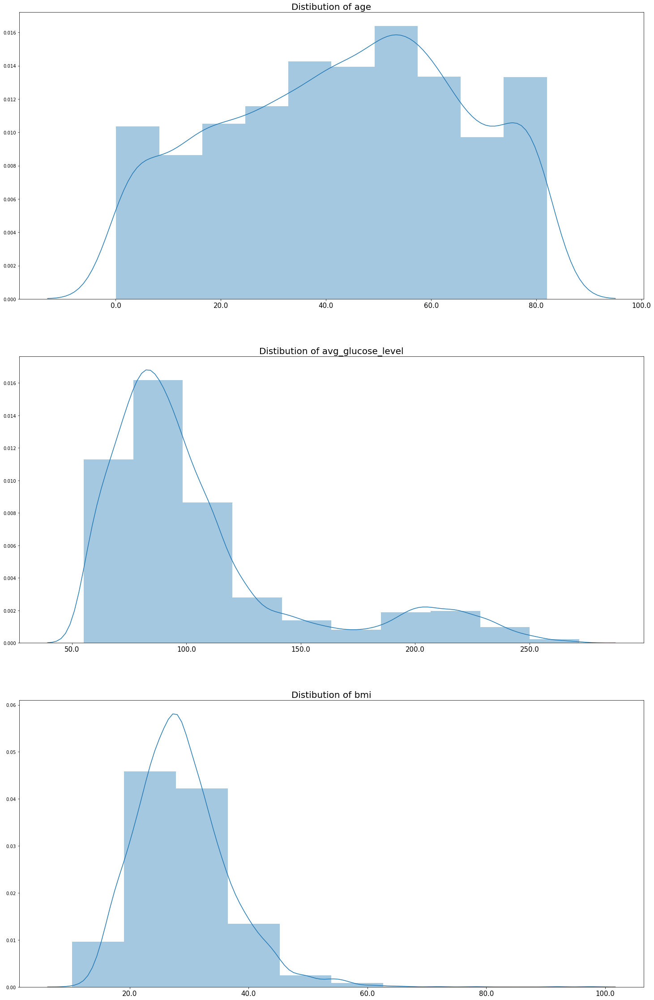
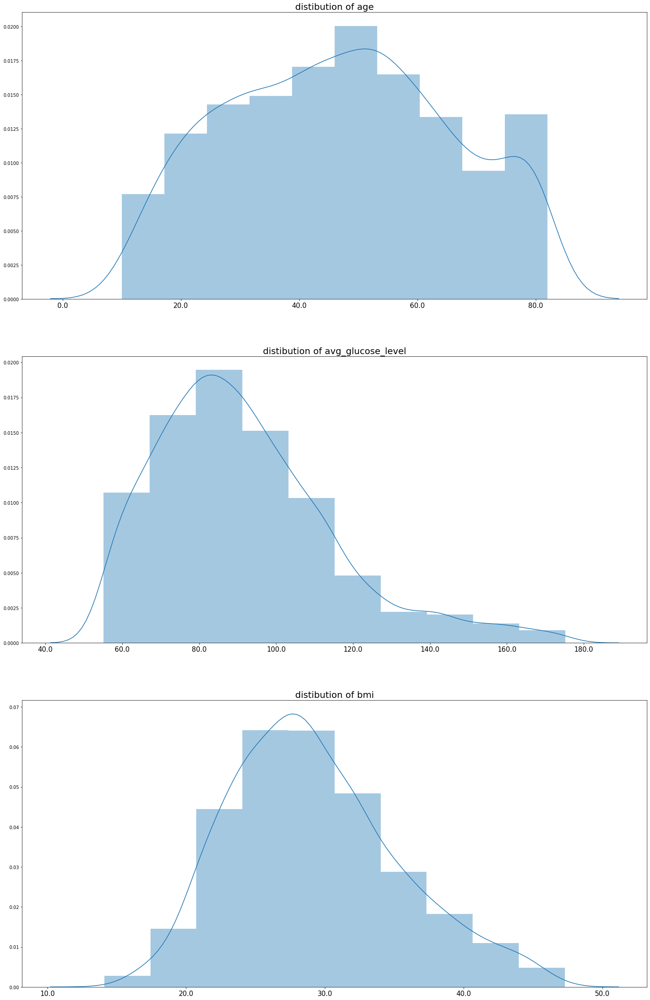
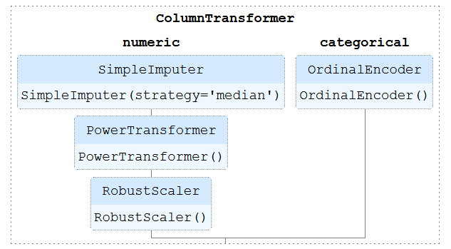
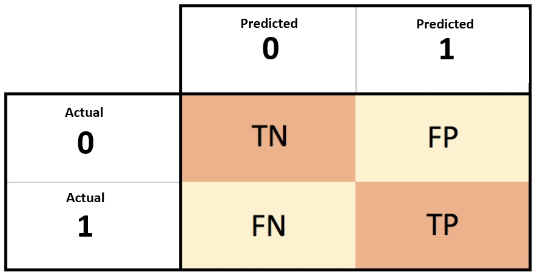

# Laporan Proyek Machine Learning - Ahmad Habib Husaini
### Domain Project
Domain proyek yang dipilih dalam proyek machine learning ini adalah mengenai kesehatan dengan judul proyek **Prediction positive or negative diabetes**".

### Pendahuluan
Kesehatan merupakan salah satu masalah umum yang telah ditetapkan dalam SDG(*Sustainable Development Goals)* oleh PBB. Pada tanggal 29 oktober nanti kita akan memperingati hari hari stroke sedunia. Stroke adalah salah satu penyakit mematikan, berupa gangguan pada fungsional otak akibat dari berbagai faktor salah satunya penyumbatan aliran darah ke otak.[sumber](http://download.garuda.ristekdikti.go.id/article.php?article=1111749&val=10153&title=IDENTIFIKASI%20HIPERTENSI%20DENGAN%20RESIKO%20KEJADIAN%20STROKE). Menurut WSO (*world stroke organization*) pada Global Stroke Fact Sheet 2019 menyatakan setiap tahunnya ada 13 juta kasus baru[sumber](https://www.world-stroke.org/assets/downloads/WSO_Fact-sheet_15.01.2020.pdf). Sudah seharusnya masalah ini tidak hanya berada pada kalangan medis, melainkan segenap rumpun ilmu. Oleh karenanya sebagai sangat membantu jika terdapat sebuat sistem cerdas yang dapat memprediksi seseorang menderita stroke.

# Bussines Understanding
### Problem Statement
- Bagaimana cara membuat model *machine learning* untuk memprediksi seseorang positif stroke atau tidak
- Feature apa saja yang sangat berpengaruh terhadap prediksi seseorang positif stroke atau tidak

### Goals
- Membuat model *machine learning* untuk memprediksi seseorang positif stroke atau tidak
- Mengetahui feature apa saja yang sangat berpengaruh terhadap prediksi seseorang positif stroke atau tidak

### Solution Statements
- #### Metodologi
    Prediksi seseorang positif stroke atau tidak merupakan tujuan dari utama yang ingin diselesaikan, potitif atau tidak (negatif) merupakan variabel diskrit yang berarti pada kasus ini merupakan persoalan klasifikasi. Oleh karena itu, metodologi pada proyek ini adalah: membangun model klasifikasi positif negatif stroke.

### Data Understanding

informasi data set : 
Attribute  | Keterangan
------------- | -------------
Sumber  | https://www.kaggle.com/fedesoriano/stroke-prediction-dataset
ID | Identitas 
Gender | Jenis kelamin (male, female, other(**dianggap invalid data**))
Hypertension | Nol jika pasien tidak menderita darah tinggi, satu sebaliknya
Heart diseease | Nol jika pasien tidak menderita penyakit jantung, satu sebaliknya
Ever married | Status pernah menikah (Yes or No)
Work type | Jenis pekerjaan terdiri dari anak-anak, Pekerjaan pemerintah, Tidak pernah bekerja, Swasta atau Wiraswasta
Residence type | Tipe tempat tinggal Rural (pedasaan) atau Urban (perkotaan)
Avg glucose type | rata-rata kadar gula dalam darah
BMI | body mass index
Smoking status | formerly smoked (Sebelumnya merokok), never smoked (tidak pernah merokok), smokes (merokok) atau "Unknown" (**dianggap invalid data**)
Stroke | satu jika pasien positif stroke nol sebaliknya

# Pra-pemrosesan
### 1. Visualisasi data kategorical dan hapus invalid data

Hapus invalid data pada kolom gender (**other**) dan kolom status merokok (**Unknown**) menjadi seperti berikut:

### 2. Visualisasi data numerik dan menghapus pencilan dengan IQR method
Pada tahap ini data numeric divisualisasikan dengan boxplot untuk mendeteksi pencilan.

Pencilan dapat dihapus dengan berbagai cara, namun pada proyek kali ini akan digunakan IQR method, simplenya syarat bukan outlier adalah ~$$(data < (Q1-1.5*IQR))$$ atau $$(data > (Q3+1.5*IQR))$$. Tanda ~ artinya negasi berarti data yang berapa diantara  $$(Q1-1.5*IQR))$$ dan $$(data > (Q3+1.5*IQR))$$ bukan outlier.

Jika dilihat masih cukup banyak outlier, namun pada proyek kali ini akan diabaikan.
### 3. Visualisasi distribusi kolom numerik

Jika diperhatikan terdapat kolom yang belum berdistribusi normal (berbentuk mirip lonceng). Hal tersebut dapat diatasi dengan melakukan transformasi. Pada proyek kali ini akan menggunakan transformasi yeo-johnson. [Yeo-johnson](https://en.wikipedia.org/wiki/Power_transform) adalah eknik transformasi data yang digunakan untuk menstabilkan varians, membuat data lebih seperti distribusi normal, meningkatkan validitas ukuran asosiasi (seperti korelasi Pearson antar variabel), dan untuk prosedur stabilisasi data lainnya. Untuk praktek transformasi pada proyek ini menggunakan pipeline dari [sklearn](https://scikit-learn.org/stable/modules/generated/sklearn.pipeline.Pipeline.html) sehingga hasil dari transformasi tidak dapat divisualisasikan.
### 4. Split data
Untuk menjaga agar tidak terjadi data leakage, makan proses train test split dijadikan sebelum proses handling missing values, transformasi dan normalisasi. Proporsi data train sebesar 80% dan test sebesar 20%.

# Modeling & Evaluation
Seperti yang sudah dijelaskan sebelumnya, pada proyek kali ini akan menggunakan pipeline seperti dibawah ini, selain itu training langsung dilakukan hyperparameterituning dengan RandomizedSearch:

- Strategi pertama
Buat model menggunakan parameter seperti dibawah ini dan *metric* yang digunakan adalah *accuracy*

*accuracy* yang didapat sangat tinggi yakni 95% untuk data testing. Eittts tunggu dulu, pada proses visualisasi sebelumnya terlewat untuk mengecek data target dan ternyata jumlah target tidak seimbang. Untuk mengukur performa dari model gunakan *confusion matrix* seperti sebagai berikut:

Jika dilihat ternyata model salah semua dalam memprediksi pasien positif (`nilai kanan bawah = 0`), oleh karenanya coba lakukan pembobotan dan gunakan scoring dengan f1-score
- Strategi dua
Lakukan pembobotan dengan memberatkan bobot pada kelas positif stroke. Untuk nilai dari bobot akan digunakan randomizedsearch lagi dengan parameter yang akan dituning sebagai berikut:

pembobotan bebisa dilihat pada algo__class_weight yang artinya {0: 0.05, 1: 0.95}, {0: 0.1, 1: 0.9}, {0: 0.25, 1: 0.75}. Dan hasil training menunjukan *confusion matrix* sebagai berikut:

`Dengan melakukan pembobotan prediksi pada data test menjadi lebih baik walau masih banyak salah prediksi`

- Strategi empat
Strategi keempat ialah dengan melakukan teknik resampling, teknik resampling merupakan pembuatan data dummy dengan algoritma tertentu, pada proyek kali ini akan digunakan algoritma SMOTE yang berdasarkan pada algoritma KNN, jika tertarik topik dapat mengunjungin tautan [berikut](https://machinelearningmastery.com/smote-oversampling-for-imbalanced-classification/).
Pada strategi keempat ini dilakukan 2 percobaan yang pertama masih dengan parameter sebelumnya, yang kedua parameter tetanggan terdekat dari algoritma smoke juga ikut ditunning serta menggunakan *recall* sebagai *metric*. 
    ##### Percobaan 1  
    
    ##### Percobaan 2
    
    Mengapa menggunakan *recall* jika diperhatikan pada rumus dibawah ini, untuk mengecilkan false negatif (salah dalam memprediksi pasien positif, metrics yang cocok adalah recall.
    ##### *Metric classification*
    Accuracy = $$\frac{TP+TN}{TP+TN+FP+FN}$$  
    Precision = $$\frac{TP}{TP+FP}$$ 
    Recall = $$\frac{TP}{TP+FN}$$  
    F1 = $$\frac{2*Precision*Recall}{Precision+Recall} = \frac{2*TP}{2*TP+FP+FN}$$  
# Kesimpulan
Kasus imbalance masih menjadi topik yang diperbincangkan, salah satu cara menangainya dengan membuat data *dummy* untuk dijadikan data training. Pada kasus kasus tertentu seperti deteksi penyakit akan lebih baik jika model salah dalam memprediksi pasien negatif (aslinya negatif diprediksi positif) dari pada aslinya positif tetapi diprediksi negatif. Namun kembali lagi pada keputusan klien atau pihak berkepentingan. Dan cara yang paling efektif untuk menangain masalah ini adalah dengan memperbanyak sample dan **`jangan`** ***`imbalance`***
### *Referensi*
1. [Dicoding](https://www.dicoding.com/academies/319/tutorials/16979?from=17053)
2. [Scikit-learn documentation](https://scikit-learn.org/)
3. [Imbalanced-learn documentation](https://imbalanced-learn.org/stable/)